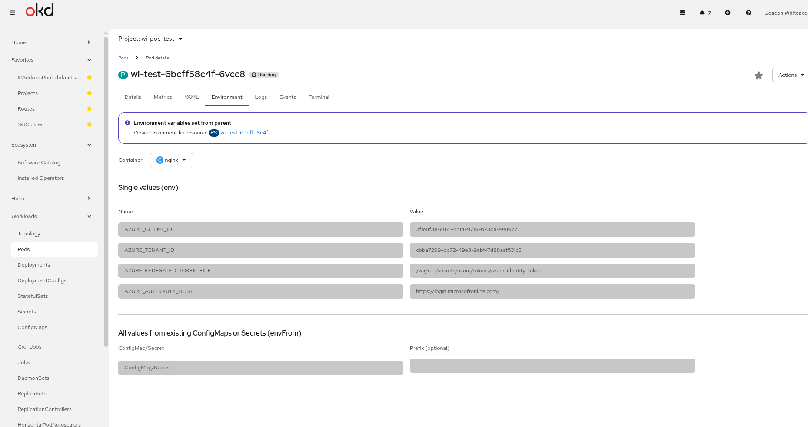
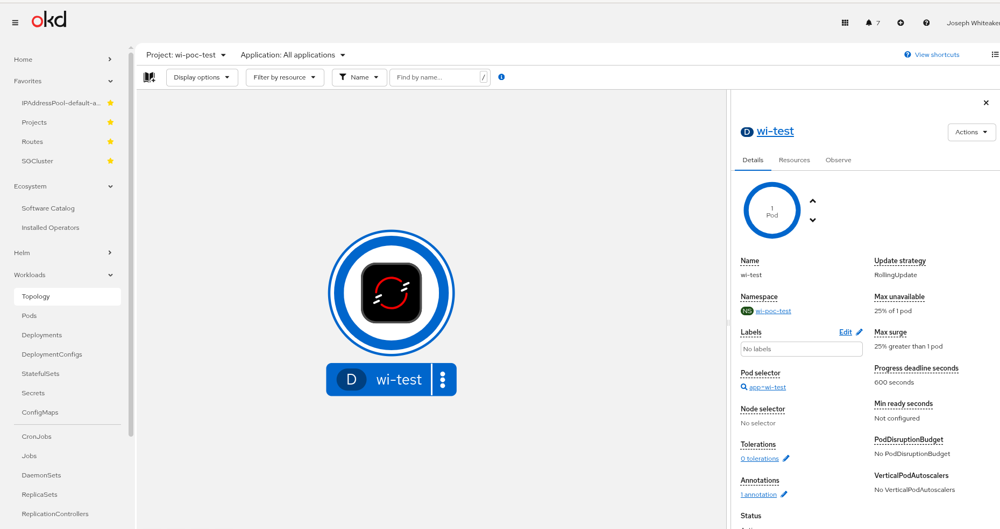

# Azure Workload Identity for On-Prem OpenShift

This repository provides automation tasks for configuring [Azure Workload Identity](https://azure.github.io/azure-workload-identity/docs/introduction.html) with on-premises OpenShift clusters.

## Overview

Azure Workload Identity enables Kubernetes workloads to authenticate to Azure services using short-lived tokens instead of hard-coded service principal credentials. This improves your cluster's security posture by:

- Eliminating long-lived credentials stored in secrets
- Using federated identity with your cluster's service account issuer
- Enabling automatic token rotation

## Prerequisites

- OpenShift cluster with `oc` CLI configured
- Azure CLI (`az`) logged in with appropriate permissions
- Helm 3.x installed
- [Task](https://taskfile.dev/) task runner installed

## Quick Start

```bash
# View all available tasks and workflow
task

# Or run individual steps
task backup-all
task backup-extract-keys
task install-azwi
# ... etc
```

## Workflow Steps

### 1. Backup Existing Resources

Before making changes, backup your cluster's current configuration:

```bash
task backup-all              # Backup signing key, apiserver, controller, authentication
task backup-extract-keys     # Extract signing keys to local files
```

### 2. Install azwi CLI (Optional)

The `azwi` CLI is used to generate JWKS from your signing keys:

```bash
task install-azwi            # Install azwi CLI
task azwi-completion         # Add bash completion
task uninstall-azwi          # Remove azwi CLI
```

### 3. Setup Azure OIDC Storage

Create an Azure Storage Account to host your OIDC discovery documents:

```bash
task oidc-create-storage-account       # Create resource group and storage account
task oidc-enable-static-website        # Enable static website hosting
task oidc-generate-discovery-document  # Generate openid-configuration.json
task oidc-upload-discovery-document    # Upload to Azure blob storage
task oidc-verify-discovery-document    # Verify public accessibility
```

### 4. Generate and Upload JWKS

Generate the JSON Web Key Set from your cluster's signing keys:

```bash
task jwks-generate    # Generate jwks.json from public key
task jwks-upload      # Upload to Azure blob storage
task jwks-verify      # Verify public accessibility
```

### 5. Update Cluster Authentication

Configure your OpenShift cluster to use the new OIDC issuer:

```bash
task auth-get-issuer      # Check current issuer
task auth-update-issuer   # Update to new Azure issuer URL
```

> ⚠️ This triggers a rolling restart of API servers. Monitor with:
> ```bash
> oc get clusteroperators kube-apiserver
> ```

### 6. Deploy Workload Identity Webhook

Install the Azure Workload Identity webhook to inject tokens into pods:

```bash
task webhook-create-namespace   # Create azure-workload-identity-system namespace
task webhook-create-helm-repo   # Create ProjectHelmChartRepository
task webhook-install-helm       # Install webhook via Helm
task webhook-fix-scc            # Fix OpenShift SCC for webhook pods

# Or run all at once:
task webhook-deploy-all
```

### 7. Rollback (If Needed)

If something goes wrong, restore from backup:

```bash
task auth-restore    # Restore authentication from backup
```

## Validating the Setup with a PoC

After completing the setup, run a quick proof-of-concept test to verify everything is working:

```bash
task poc-test
```

This script validates the entire workload identity flow by:

1. **Creating an OpenShift project** (`wi-poc-test`) with a service account
2. **Creating Azure resources**:
   - A resource group (`wi-poc-rg`)
   - A user-assigned managed identity (`wi-poc-identity`)
   - A federated identity credential linking your cluster's service account to the managed identity
3. **Deploying a test pod** with the required labels and annotations
4. **Verifying webhook mutation** - checking that the Azure Workload Identity webhook injected the correct environment variables and token volume

### How It Works

The webhook watches for pods with the label `azure.workload.identity/use: "true"`. When it finds one, it:

1. Reads the `azure.workload.identity/client-id` annotation from the pod's service account
2. Injects these environment variables into all containers:
   - `AZURE_CLIENT_ID` - The managed identity client ID
   - `AZURE_TENANT_ID` - Your Azure AD tenant ID  
   - `AZURE_FEDERATED_TOKEN_FILE` - Path to the projected token
   - `AZURE_AUTHORITY_HOST` - Azure AD authority URL
3. Mounts a projected service account token at `/var/run/secrets/azure/tokens/azure-identity-token`

### Expected Output

If successful, you'll see the injected environment variables:



And the mounted token file:



### Cleanup

```bash
oc delete project wi-poc-test
az group delete --name wi-poc-rg --yes --no-wait
```

## Configuration

Edit `taskfile.yaml` to customize these variables:

| Variable | Description | Default |
|----------|-------------|---------|
| `RESOURCE_GROUP` | Azure resource group name | `homelab` |
| `LOCATION` | Azure region | `eastus` |
| `AZURE_STORAGE_ACCOUNT` | Storage account name | - |
| `AZURE_STORAGE_REGION` | Storage region code (e.g., z13) | - |
| `ISSUER_URL` | Full OIDC issuer URL | - |
| `PUBLIC_KEY_PATH` | Path to extracted public key | `sa-signer.pub` |

## Generated Files

| File | Description |
|------|-------------|
| `sa-signer.key` | Private signing key (sensitive!) |
| `sa-signer.pub` | Public signing key |
| `backup-*.yaml` | Backup files for cluster resources |
| `openid-configuration.json` | OIDC discovery document |
| `jwks.json` | JSON Web Key Set |

## Using Workload Identity in Your Pods

Once configured, annotate your service accounts to use Azure Workload Identity:

```yaml
apiVersion: v1
kind: ServiceAccount
metadata:
  name: my-app
  annotations:
    azure.workload.identity/client-id: "<AZURE_CLIENT_ID>"
    azure.workload.identity/tenant-id: "<AZURE_TENANT_ID>"
```

And add the label to your pods:

```yaml
apiVersion: v1
kind: Pod
metadata:
  labels:
    azure.workload.identity/use: "true"
spec:
  serviceAccountName: my-app
  # ...
```

## Documentation

- [Azure Workload Identity Introduction](https://azure.github.io/azure-workload-identity/docs/introduction.html)
- [Workload Identity Overview (Microsoft Learn)](https://learn.microsoft.com/en-us/azure/aks/workload-identity-overview?tabs=dotnet)
- [Self-Managed Clusters Setup](https://azure.github.io/azure-workload-identity/docs/installation/self-managed-clusters.html)
- [OIDC Issuer Discovery Document](https://azure.github.io/azure-workload-identity/docs/installation/self-managed-clusters/oidc-issuer/discovery-document.html)
- [JWKS Setup](https://azure.github.io/azure-workload-identity/docs/installation/self-managed-clusters/oidc-issuer/jwks.html)

## License

MIT
